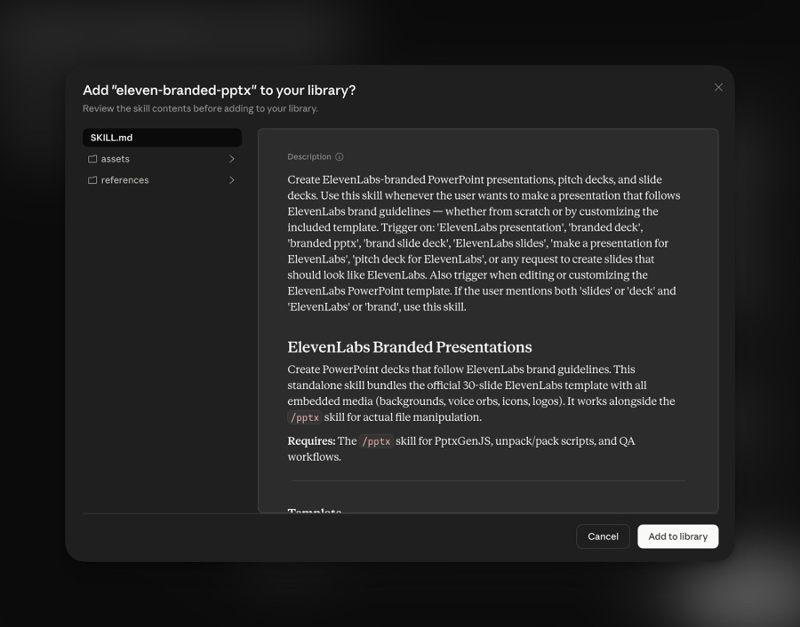

<p align="center">
  <picture>
    <source media="(prefers-color-scheme: dark)" srcset="brand-assets/logos/Logo-white.png">
    
  </picture>
</p>

<h1 align="center">ElevenLabs Brand Kit</h1>

A Claude Code plugin for producing on-brand ElevenLabs content -- web apps, landing pages, marketing sites, presentations, and HyperFrames videos. Brand assets, design guidelines, and creative workflows in one package.

<p align="center">
  <a href="#for-claude-code"></a>
  <a href="#for-claude-desktop--cowork-desktop"></a>
  <a href="#brand-assets"></a>
  <a href="#whats-included"></a>
</p>

## What's Included

| Skill | Command | What It Does |
|-------|---------|-------------|
| **Asset Setup** | `/elevenlabs-brand-kit:asset-setup` | Download brand assets (~75MB), bootstrap a project, configure storage |
| **Brand** | `/elevenlabs-brand-kit:brand` | Enforce ElevenLabs brand guidelines on any content |
| **Branded Web** | `/elevenlabs-brand-kit:branded-web` | Build ElevenLabs-branded web experiences (HTML, CSS, React, Tailwind, shadcn/ui) |
| **Branded PPTX** | `/elevenlabs-brand-kit:eleven-branded-pptx` | Create ElevenLabs-branded PowerPoint presentations from the included 30-slide template |
| **HyperFrames** | `/elevenlabs-brand-kit:hyperframes` | Official HeyGen HyperFrames reference -- composition authoring, timing, media, captions, audio-reactive visuals, transitions |
| **HyperFrames CLI** | `/elevenlabs-brand-kit:hyperframes-cli` | HyperFrames CLI commands -- init, lint, preview, render, transcribe, tts, doctor |
| **HyperFrames Spec Builder** | `/elevenlabs-brand-kit:hyperframes-spec` | Draft scene-by-scene video blueprints with layouts, modes, backgrounds (replaces Remotion Spec Builder) |
| **HyperFrames Builder** | `/elevenlabs-brand-kit:hyperframes-builder` | Generate HTML+GSAP HyperFrames compositions from spec files (replaces Remotion Builder) |

> **Deprecated (kept for legacy projects)**: `remotion-spec`, `remotion-builder`, and `remotion-best-practices`. The Remotion video pipeline has been retired in favor of HyperFrames (HTML+GSAP) for faster iteration. See the CHANGELOG for the v4.0.0 swap rationale.

### When to use which

- **"Build a branded web page"** -> **Branded Web** -- CSS tokens, card variants, font loading, noise overlays, Tailwind/shadcn setup
- **"Make a presentation"** -> **Branded PPTX** -- ElevenLabs-branded decks from the included 30-slide template (requires `/pptx` skill)
- **"Is this on-brand?"** -> **Brand** -- checks content against ElevenLabs brand guidelines
- **"Set up a new project"** -> **Asset Setup** -- downloads brand assets and bootstraps the project
- **"Spec out a video"** -> **HyperFrames Spec Builder** -- creates the video blueprint (scene layouts, modes, durations)
- **"Implement this spec"** -> **HyperFrames Builder** -- generates the HTML+GSAP composition from a spec file
- **"What's the HyperFrames runtime contract?"** -> **HyperFrames** -- official framework reference
- **"How do I run the HyperFrames CLI?"** -> **HyperFrames CLI** -- official CLI reference

## Installation

### For Claude Code

**Via marketplace (recommended):**

```
/plugin marketplace add jakeat11labs/elevenlabs-brand-kit
```

```
/plugin install elevenlabs-brand-kit@elevenlabs-brand-kit
```

**Via `npx plugins` (cross-tool, no slash commands):**

The [`plugins`](https://www.npmjs.com/package/plugins) CLI from Vercel Labs installs into Claude Code (and Cursor, if detected) in one shot. It reads this repo's `.claude-plugin/marketplace.json` directly -- no extra setup on the author side.

```bash
npx plugins add jakeat11labs/elevenlabs-brand-kit
```

Useful flags:

```bash
# Preview without installing
npx plugins discover jakeat11labs/elevenlabs-brand-kit

# Force a specific target / scope, skip the confirmation prompt
npx plugins add jakeat11labs/elevenlabs-brand-kit -t claude-code -s user -y
```

**Local development:**

```bash
git clone https://github.com/jakeat11labs/elevenlabs-brand-kit.git
claude --plugin-dir ./elevenlabs-brand-kit
```

### For Claude Desktop / Cowork Desktop

> **Note:** Only the **Branded PPTX** skill is currently packaged for Claude Desktop / Cowork Desktop. The rest of the kit (web, HyperFrames video, asset-setup, brand) is Claude Code-only for now. More standalone skills are on the way.

Individual skills are available as standalone `.skill` files that bundle everything needed -- no plugin setup required.

**How to install (easy way):**

1. Download the `.skill` file from the table below
2. **Double-click it** -- Claude Desktop / Cowork Desktop should open and show this dialog:

<p align="center">
  
</p>

3. Click **Add to library** and you're done.

**If double-click doesn't open the dialog** (manual install):

1. Open Claude Desktop or Cowork Desktop
2. Go to **Customize** in the sidebar (towards the top)
3. Click **Skills** at the very top
4. Click the **+** button under Skills
5. Under **Create Skill**, select **Upload a Skill**
6. Select the downloaded `.skill` file

**Available standalone skills:**

| Skill | Download | Size | What's Included |
|-------|----------|------|----------------|
| **Branded PPTX** | [eleven-branded-pptx.skill](https://github.com/jakeat11labs/elevenlabs-brand-kit/releases/latest/download/eleven-branded-pptx.skill) | ~11MB | 30-slide ElevenLabs template with 54 embedded media files (backgrounds, voice orbs, icons, logos), brand tokens, layout guide |

Each `.skill` file is self-contained -- it bundles the template and all reference materials so the agent can create on-brand presentations without any additional downloads.

### For Any Agent (via skills.sh)

Use the [`skills` CLI](https://skills.sh) to install individual skills into any supported agent -- Claude Code, Codex, Cursor, OpenCode, and [40+ others](https://github.com/vercel-labs/skills#available-agents). No plugin required.

**Install everything (all 8 current skills):**

```bash
npx skills add jakeat11labs/elevenlabs-brand-kit
```

**Install a specific skill:**

_Asset Setup -- bootstrap a project, download brand assets_

```bash
npx skills add jakeat11labs/elevenlabs-brand-kit --skill asset-setup
```

_Brand -- enforce ElevenLabs brand guidelines_

```bash
npx skills add jakeat11labs/elevenlabs-brand-kit --skill elevenlabs-brand
```

_Branded Web -- build ElevenLabs-branded web experiences_

```bash
npx skills add jakeat11labs/elevenlabs-brand-kit --skill branded-web
```

_Branded PPTX -- ElevenLabs-branded PowerPoint presentations_

```bash
npx skills add jakeat11labs/elevenlabs-brand-kit --skill eleven-branded-pptx
```

_HyperFrames -- official framework reference_

```bash
npx skills add jakeat11labs/elevenlabs-brand-kit --skill hyperframes
```

_HyperFrames CLI -- init, lint, preview, render, transcribe, tts_

```bash
npx skills add jakeat11labs/elevenlabs-brand-kit --skill hyperframes-cli
```

_HyperFrames Spec -- draft scene-by-scene video blueprints_

```bash
npx skills add jakeat11labs/elevenlabs-brand-kit --skill hyperframes-spec
```

_HyperFrames Builder -- generate HTML+GSAP compositions from specs_

```bash
npx skills add jakeat11labs/elevenlabs-brand-kit --skill hyperframes-builder
```

Add `-g` to install globally (available across all projects), or `-a <agent>` to target a specific agent (e.g. `-a claude-code`, `-a codex`, `-a cursor`). See the [`skills` CLI docs](https://skills.sh/docs/cli) for all options.

## Quick Start

### For Web Projects

1. Install the plugin
2. Run `/elevenlabs-brand-kit:asset-setup` -- choose "HTML / web project"
3. Start building with `/elevenlabs-brand-kit:branded-web` for CSS tokens, card variants, font loading, and layout guidance
4. Check brand compliance with `/elevenlabs-brand-kit:brand`

### For Video Projects

1. Install the plugin
2. Run `/elevenlabs-brand-kit:asset-setup` -- choose "HyperFrames video project"
3. Draft a spec with `/elevenlabs-brand-kit:hyperframes-spec`
4. Build it with `/elevenlabs-brand-kit:hyperframes-builder`
5. Use `/elevenlabs-brand-kit:hyperframes-cli` for lint, preview, render, transcription, and TTS commands

### For Presentations

1. Install the plugin (or download the standalone [`eleven-branded-pptx.skill`](https://github.com/jakeat11labs/elevenlabs-brand-kit/releases/latest/download/eleven-branded-pptx.skill) for Claude Desktop)
2. Run `/elevenlabs-brand-kit:asset-setup` to download brand assets (includes the PowerPoint template)
3. Create branded decks with `/elevenlabs-brand-kit:eleven-branded-pptx` (requires the `/pptx` skill for file tooling)

## Brand Assets

Brand assets (~75MB optimized) are distributed via [GitHub Releases](https://github.com/jakeat11labs/elevenlabs-brand-kit/releases). The `asset-setup` skill downloads them and supports both project-local and central (`~/.elevenlabs-kit/`) storage.

**Included:**
- **52+ background images** -- gradients, agents-themed, Chladni close-ups, shared textures
- **400+ brand icons** -- cream, black, and white variants (130 each) + 10 product icons
- **8 voice orbs** -- metallic spheres in teal, purple, pink, coral, green, gold, hotpink, lavender
- **Logos** -- black + white wordmark, II symbol
- **4 KMR Waldenburg fonts** -- Book, Normal, Halbfett, Fett weights
- **Color tokens** (`color-tokens.json`) + **Brand Guidelines** (`BRAND_GUIDELINES.md`)
- **Presentation template** -- 30-slide branded PowerPoint with 80 layout masters and 54 embedded media
- **Visual catalog** (`index.html`) -- browse every asset with one-click copy buttons

## V2 Design System

The kit includes the full ElevenLabs V2 visual system, applicable to web, video, and presentations:

- **Hero mode** -- Gradient backgrounds, frosted BrandedCards, white text
- **Content mode** -- OFF_WHITE backgrounds, CREAM cards, GRAPHITE text
- **Hybrid mode** -- White left / gradient right split layouts
- **8 BrandedCard variants** -- darkflat, darkglass, glass, baseline, outline, pill, acrylic, gradientborder
- **Monochrome palette** -- Graphite, Off-White, Cream, Light-Gray, Mid-Gray; color comes from imagery

## Project Structure

```
elevenlabs-brand-kit/
├── .claude-plugin/
│   ├── plugin.json              # Plugin manifest
│   └── marketplace.json         # Marketplace catalog
├── brand-assets/                # ~75MB optimized brand assets
│   ├── backgrounds/             # Gradients, agents, Chladni, textures
│   ├── icons/                   # 130 icons x 3 variants + product icons
│   ├── voice-orbs/              # 8 metallic orb images
│   ├── logos/                   # Wordmark + II symbol
│   ├── fonts/                   # KMR Waldenburg (4 weights)
│   ├── elevenlabs-presentation-template.pptx  # 30-slide branded template
│   ├── BRAND_GUIDELINES.md      # Official 2025 brand guidelines
│   ├── CLAUDE.md                # Asset inventory + usage guide
│   ├── color-tokens.json        # Color definitions
│   └── index.html               # Visual asset catalog
├── skills/
│   ├── asset-setup/             # Project bootstrap + asset download
│   ├── brand/                   # Brand guideline enforcement
│   ├── eleven-branded-pptx/            # ElevenLabs-branded presentations
│   │   └── references/          # Template layout guide
│   ├── branded-web/             # Web development with brand system
│   │   └── rules/               # CSS tokens, Tailwind, shadcn, cards, backgrounds, typography
│   ├── hyperframes/             # Official HyperFrames framework reference
│   │   ├── references/          # Runtime, motion, transitions, transcript guidance
│   │   └── scripts/             # Validation and reporting helpers
│   ├── hyperframes-cli/         # HyperFrames CLI command reference
│   ├── hyperframes-builder/     # HTML+GSAP composition generation from specs
│   │   ├── rules/               # Brand system, animations, scenes, compositions
│   │   └── references/          # CSS class inventory, bundled assets
│   ├── hyperframes-spec/        # HyperFrames spec drafting
│   │   ├── assets/              # Spec templates and examples
│   │   ├── rules/               # Scene layouts, modes, backgrounds
│   │   └── references/          # Brand guidelines, asset inventory
│   ├── remotion-best-practices/ # Deprecated legacy Remotion reference
│   ├── remotion-builder/        # Deprecated legacy Remotion builder
│   └── remotion-spec/           # Deprecated legacy Remotion spec drafting
├── standalone/
│   └── eleven-branded-pptx/            # Standalone skill source (packaged into .skill)
│       ├── SKILL.md
│       ├── references/
│       └── assets/              # Bundled template PPTX
├── eleven-branded-pptx.skill           # Downloadable standalone skill (zip)
└── README.md
```

## License

For ElevenLabs internal use only. This plugin is for authorized use by ElevenLabs employees. Brand assets, guidelines, fonts, and curriculum content are proprietary to ElevenLabs. No unauthorized use, reproduction, or distribution is permitted.
